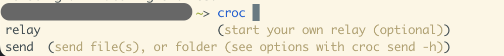

# complish


[English](./README.md) | [简体中文](./README-zh.md)

<h3 align="center">使用 chatGPT 为你的 CLI 生成自动Fish Shell 补全提示文件</h3>

Complish 是一个为任意 CLI 生成 Fish Shell 自动补全文件的工具。

该工具使用 ChatGPT API 来解析 CLI 的帮助页面（即执行 cmd --help 时打印的文本），并输出有关此帮助页面的结构化信息。然后生成一个 fish completion 脚本，关于 fish completion 的详细信息，请参见 fish completion。

没用过 Fish？ 强烈推荐试试！ https://fishshell.com/

## 安装

```bash
npm i -g complish
```

## 使用

```bash
complish [options] [cmd]
```

首先需要设置环境变量 OPENAI_API_KEY。如果没有这个密钥，可以在 [OpenAI](https://platform.openai.com/account/api-keys) 上申请一个，并确保保密！

```bash
export OPENAI_API_KEY=your_openai_api_key
```

Example:

给知名文件传输工具 [croc](https://github.com/schollz/croc) 生成补全文件。
```bash
complish croc
```
然后你就会在当前目录得到一个 `croc.fish`

之后把这个文件复制到 Fish 能自动加载的目录下即可，其他目录参见[这里](https://fishshell.com/docs/current/completions.html)

```bash
cp ./croc.fish ~/.config/fish/completions/
source
```

然后你会发现按下 tab 键的时候补全就开始工作了


## 开发

克隆这个仓库

```bash
git clone https://github.com/werifu/complish.git
```

我用 pnpm 管理依赖：

```bash
pnpm i
```

之后编译 TS 代码并执行编译后的 JS 文件：

```bash
pnpm build
./dist/index.js
```

或者你可以直接用 ts-node 跑起来：

```bash
pnpm dev
```

## 贡献

PR、issue 都欢迎！
欢迎给我提建议😊

## TODO

* [ ] 帮助文本分段（chatGPT 处理不了太长的文本）
* [ ] 减少 API 调用（主要瓶颈）
