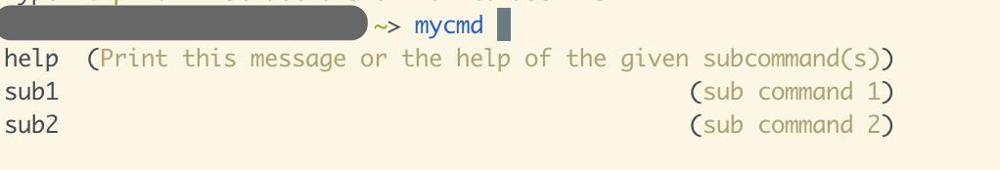
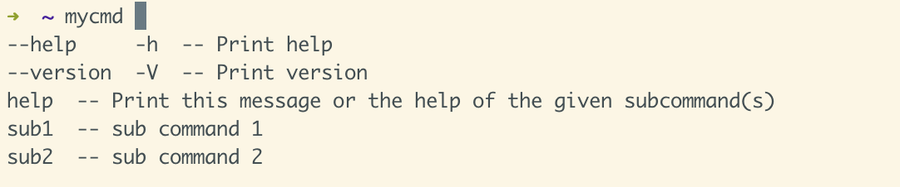

# complish


[English](./README.md) | [简体中文](./README-zh.md)

<h3 align="center">Generate auto-completion file for any CLI via chatGPT.</h3>

Complish is a tool to generate completion file for any type of CLI, now supports __zsh__ and __fish__.

The tool uses chatGPT API to parse the help page of a CLI (the text printed when executing `cmd --help`) and output structured information about the help page. And then generate a completion script for specific shell like zsh or fish.

## Installing

```bash
npm i -g complish
```

## Usage

```bash
complish [options] [cmd]
```

API key of OpenAI is necessary, and you can set the key either by setting an environment variable or using `complish set-key` like following:

```bash
export OPENAI_API_KEY=your_openai_api_key
```

or

```bash
complish set-key your_openai_api_key
```

If you have no the key, you can apply for one on [OpenAI](https://platform.openai.com/account/api-keys) and remember to keep secret!


### Example in fish

Generate a fish completion for a CLI named `mycmd` 
```bash
complish mycmd --shell fish
```

And you will find mycmd.fish in your current directory when the script finished. 

> Note that the execution speed is limited by the response time of ChatGPT, so it may take 10 seconds to 1 minute or more to generate a completion file.

Then copy the fish script to the completions directory of fish shell for which the file can be automatically loaded. Other available fish completion directories can be seen [here](https://fishshell.com/docs/current/completions.html)

```bash
cp ./croc.fish ~/.config/fish/completions/
```

It will work after you reopen the terminal and you will find the completion works when you press \<TAB\>



### Example in zsh

Generate a zsh completion for a CLI named `mycmd` 
```bash
complish mycmd --shell zsh
```
And you will find _mycmd file which is the format of zsh-completion file in your current directory when the script finished. 

Then copy the zsh completion file to a directory that is in environment variable `$fpath`. You can check it by running `echo $fpath` for all valid directories in zsh.

```bash
cp ./_mycmd /Users/you/.zsh/functions
```

It will work after you reopen the terminal and you will find the completion works when you press \<TAB\>




## Development

Clone this repo.

```bash
git clone https://github.com/werifu/complish.git
```

I use pnpm to manage dependencies:

Install dependencies:
```bash
pnpm i
```

Compile TypeScript code and run the compiled JavaScript:
```bash
pnpm build
./dist/index.js
```

or you can run it using ts-node directly:

```bash
pnpm dev
```

## Contribute

Pull requests / issues are both welcome! 

Please give me your suggestions or other feedback! 😊

## TODO
* [ ] Support bash completion (in planning)
* [ ] Reduce API calling times (bottle neck of this tool)
* [ ] More detail arguments completion
